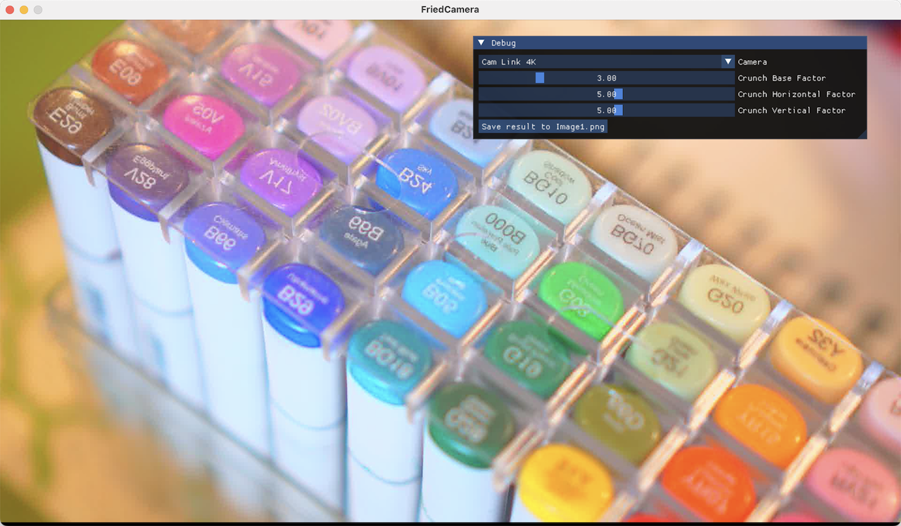

# SDL 3 Compute DCT

This repository contains a simple application using [SDL_gpu](https://wiki.libsdl.org/SDL3/CategoryGPU) that applies a JPEG-style DCT quantization effect to images from a camera feed in real-time, using compute shaders to let you adjust the quantization factors. It's a simple demonstration of:

* Reading image data from a camera using the [SDL3 Camera API](https://wiki.libsdl.org/SDL3/CategoryCamera), including waiting for permissions on systems like macOS
* Using HLSL shaders with [SDL_shadercross](https://github.com/libsdl-org/SDL_shadercross) on non-Windows systems
* Using `groupshared` memory and barriers to perform DCT, quantization, and IDCT in a single compute dispatch
* Applying [imgui](https://github.com/ocornut/imgui)'s SDL3 + SDL_gpu backend to a simple interactive app



It's also an excuse to explore targeted optimizations for a non-trivial but uniform compute kernel on different GPUs, with different profiling tools. And they tell different stories: Nsight Graphics says that the kernel is bottlenecked on VRAM bandwidth, while Metal Debugger says that it's bottlenecked on instruction issue.

## Limitations

* The code assumes that the camera feed is in the NV12_YUV format (as reported by SDL). If that's not the case, the UI will display a warning message.
* The code assumes that your camera's image is 16:9. Using any other aspect ratio (like 4:3) will apply the DCT effect correctly, but the output texture will be rendered stretched.
* The window is always 1280x720, non-resizable. Most webcams I came across output in this resolution.
* The compute kernel only works in 16x16 pixel blocks. Because of the way memory accesses are distributed, we can't use thread masking to only read the valid range of an image, so we only process up to the last integer multiple of 16px in both dimensions - for 1920x1080, that's 1920 (120x16) by 1072 (67x16).

## Build Prerequisites

Make sure you have the following installed in your machine:

* CMake (through Kitware's installer, `winget` on Windows, `brew` on macOS, or your package manager on Linux)
* A C++17 compiler
  * On Windows, get [Visual Studio](https://visualstudio.microsoft.com/thank-you-downloading-visual-studio/?sku=Community)
  * On macOS, get [Xcode](https://apps.apple.com/us/app/xcode/id497799835)
  * On Linux, get a compiler toolchain like `gcc` or `clang`
* [vcpkg](https://github.com/microsoft/vcpkg), or install `imgui`, `sdl3`, and `spdlog` by compiling their source or through your package managers of choice
* For non-Windows systems, you need `SDL_shadercross` already built and installed somewhere

## Building

```bash
# If using Ninja and vcpkg on Windows
cmake \
    -S . \
    -B Build \
    -G Ninja \
    -DCMAKE_TOOLCHAIN_FILE=(...)/vcpkg/scripts/buildsystems/vcpkg.cmake
ninja

# If using Xcode and vcpkg on macOS
cmake \
    -S . \
    -B Build \
    -G Xcode \
    -DSHADERCROSS_PATH=(...)/SDL_shadercross/build/shadercross \
    -DCMAKE_TOOLCHAIN_FILE=(...)/vcpkg/scripts/buildsystems/vcpkg.cmake
open Build/Sdl3ComputeDct.xcodeproj

# If you installed the dependencies with a package manager, on Linux
$> cmake ..
$> cmake --build .
```

Make sure to run the executable from the built directory so that it picks up the compiled shader files (`.dxil` on Windows, `.metallib` on macOS, and `.spirv` on Linux).

## Lil' Benchmarks

Using the tools best supported by each vendor (Metal Debugger, PIX, and Nsight Graphics), we get the following numbers just for the compute kernel.

### GPUs tested

| Vendor |              GPU          |  Release   | Node       |
|--------|---------------------------|------------|------------|
| Apple  | M4 (10-core)              | May 2024   | TSMC N3E   |
| Intel  | UHD 630                   | Sep. 2017  | Intel 14nm |
| NVIDIA | GeForce RTX 2060 (mobile) | Oct. 2018  | TSMC 12FFC |

### Numbers

|    GPU    |  Power State  | Resolution  | Duration(µs) | MPixels/s |
|-----------|---------------|-------------|--------------|-----------|
| M4        | Min Power     | 1920 x 1072 |        3'010 |      683  |
|           |               | 3840 x 2160 |       12'030 |      689  |
|           | Max Power     | 1920 x 1072 |          642 |    3'205  |
|           |               | 3840 x 2160 |        2'580 |    3'214  |
| UHD 630   | Low Power     | 1280 x 720  |        5'750 |      160  |
|           |               | 3840 x 216  |       49'427 |      167  |
|           | High Power    | 1280 x 720  |        2'131 |      432  |
|           |               | 3840 x 216  |       17'940 |      462  |
| RTX 2060  | Lock to Base  | 1280 x 720  |          628 |    1'468  |
|           |               | 3840 x 216  |        5'128 |    1'617  |
|           | Lock to Boost | 1280 x 720  |          571 |    1'614  |
|           |               | 3840 x 216  |        4'724 |    1'756  |
